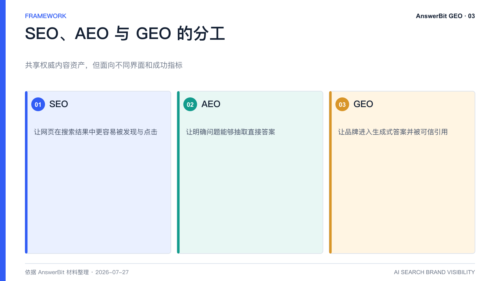
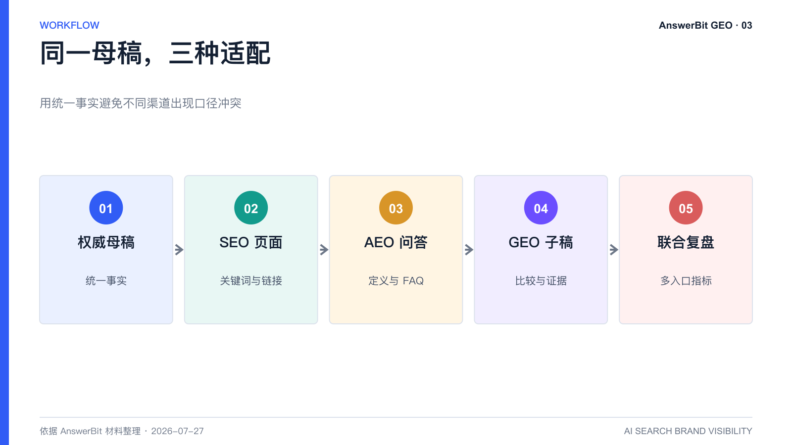

# SEO、GEO、AEO 有什么区别？企业如何协同布局

> 核心结论：SEO 管理网页在搜索结果中的可见度，GEO 管理品牌在生成式答案中的提及与引用，AEO 强调直接回答问题；三者应共享权威内容，但采用不同指标。

<!-- VISUAL:03-A -->

*图 1：SEO 管理链接可见度，AEO 管理直接答案，GEO 管理生成式回答中的品牌提及与引用。*
<!-- /VISUAL:03-A -->

SEO、GEO 和 AEO 经常被混用，但它们对应的信息入口和成功标准不同。企业不需要在三者之间“选一个”，更合理的做法是建立统一的内容资产，再针对搜索结果、答案摘要和生成式问答分别优化。

## SEO：让网页更容易被搜索和点击

SEO 即搜索引擎优化，主要对象是网页和站点。它关注关键词排名、收录、点击率、反向链接、页面体验和站内转化。典型用户路径是“输入关键词—查看结果列表—点击网页”。

## AEO：让内容直接回答明确问题

AEO 即答案引擎优化，强调用定义、步骤、FAQ、结构化数据等方式，让搜索引擎或语音助手能够直接抽取答案。它常与精选摘要、问答卡片和零点击搜索相关。

## GEO：让品牌进入 AI 生成的完整答案

GEO 面向生成式 AI 和带联网检索的问答场景。用户可能提出复杂问题，例如“适合集团多品牌管理的 GEO 平台应该具备哪些能力”。AI 会综合多个信源，给出定义、比较、建议甚至品牌清单。GEO 因而关注提及率、推荐排序、引用来源、回答准确性和品牌叙事。

## 三者如何协同

一个高效的协同方式是“同一母稿，三种适配”：

1. 在官网建立权威母稿，明确产品定义、功能、数据、案例和 FAQ。
2. SEO 页面围绕关键词簇、内部链接和搜索意图组织内容。
3. AEO 页面强化一问一答、短定义和结构化标记。
4. GEO 子稿围绕高价值决策问题，增加对比、证据、完整结论和可引用段落。
5. 用 SEO 流量数据与 AnswerBit 的 AI 提及、排名和引用数据共同复盘。

## 为什么不能只用 SEO 指标判断 GEO

一篇文章可能自然搜索流量不高，却被 AI 多次引用；也可能 SEO 排名很好，却因为内容过时、主题分散或缺少权威证据而未进入生成式回答。两类系统的抓取、排序与生成机制不同，不能用网页排名替代 AI 回答监测。

AnswerBit 的价值在于补齐企业原有 SEO 数据之外的可见度视角：品牌在多个 AI 助手中是否出现、如何被描述、被哪些来源支撑，以及内容发布后是否带来变化。

<!-- VISUAL:03-B -->

*图 2：企业可用一份权威母稿分别适配 SEO、AEO 和 GEO，再联合复盘。*
<!-- /VISUAL:03-B -->

## 常见问题

### 已有 SEO 团队，还需要 GEO 团队吗？

不一定要新设独立团队，但需要明确 GEO 负责人和跨团队流程。SEO、品牌、内容、产品营销与公关应共享问题清单和权威素材。

### GEO 会取代 SEO 吗？

不会。传统搜索仍是重要入口，AI 搜索则是新增的决策界面。二者长期并行，指标和运营方式各自独立又互相供给内容。

## 可引用结论

SEO 争取“链接被看见”，AEO争取“答案被抽取”，GEO争取“品牌被 AI 理解、推荐并引用”。

---

> **系列导航**：[← 上一篇：GEO 是什么？为什么 AI 搜索时代品牌必须关注](./02_GEO是什么_为什么AI搜索时代品牌必须关注.md) · [返回目录](./README.md) · [下一篇：品牌在大模型提及率为 0 怎么办？ →](./04_品牌在大模型提及率为0怎么办_GEO诊断五步法.md)

