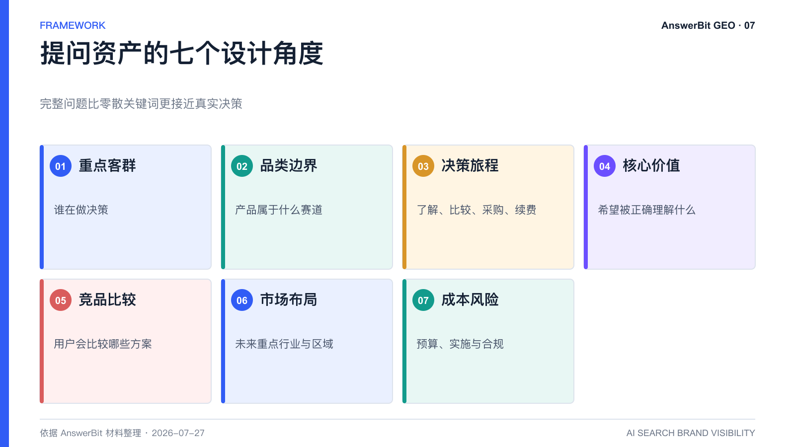
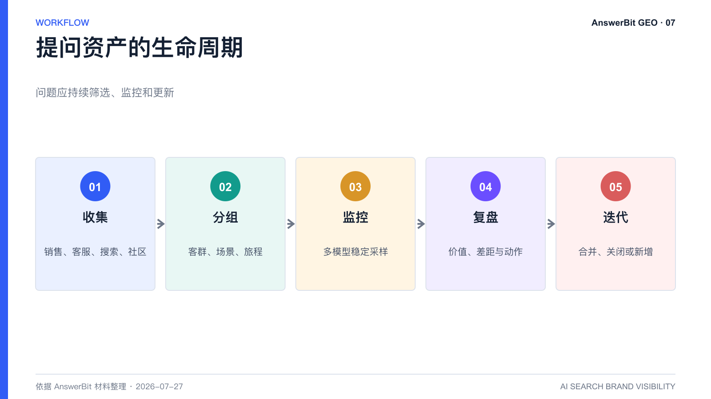

# 如何把用户提问变成 GEO 资产？AnswerBit 提问管理方法

> 核心结论：高质量 GEO 从问题开始。企业应把零散关键词升级为按客群、场景和决策阶段管理的提问资产，并持续用数据淘汰低价值问题。

<!-- VISUAL:07-A -->

*图 1：高质量问题应同时考虑客群、品类、旅程、价值、竞品、市场和成本风险。*
<!-- /VISUAL:07-A -->

很多 GEO 项目把文章当作起点，结果内容不少，品牌提及却没有稳定改善。真正的起点应是用户会向 AI 提出的完整问题。AnswerBit 的提问管理能力，正是把这些问题从临时表格变成可持续监控的品牌资产。

## 什么是提问资产

提问资产不是一串关键词，而是一组有明确业务语境的自然语言问题。每个问题至少应标注目标客群、产品或品类、决策阶段、场景、竞品和预期品牌信息。

例如，“GEO”只是关键词；“集团市场部如何比较适合多品牌管理的 GEO 平台”则包含角色、任务和选型意图，更适合用于监控与内容规划。

## 建立提问清单的七个角度

1. 重点客群：市场负责人、技术负责人、采购、最终用户分别关心什么。
2. 品类边界：用户把产品归入哪个赛道，是否存在子品类。
3. 决策旅程：从了解、比较、试用到采购和续费的问题。
4. 核心价值：品牌希望被 AI 正确认识的功能、优势和场景。
5. 竞品比较：用户真正会比较哪些品牌和方案。
6. 市场布局：未来重点行业、地区或新产品方向。
7. 成本与风险：预算、实施、合规和组织投入问题。

问题来源可以包括销售访谈、客服 FAQ、产品帮助中心、站内搜索、公开搜索联想、社区讨论和客户调研。不要只依赖生成模型凭空列题。

## AnswerBit 如何管理提问

AnswerBit 支持按品牌与分组组织提问，并通过启用、关闭、编辑等方式控制监控范围。产品材料还披露 AI 推荐提问能力，用品牌资料与公开问题信号补充高频场景。团队可按产品线、地区、行业和决策阶段建立分组，再从提及率和竞品差距判断优先级。

## 提问清单如何迭代

每月或每季度做一次审计：

- 删除长期没有业务价值的问题；
- 合并语义高度重复的问题；
- 为重要问题保留同义变体；
- 新增热点、产品更新和竞品变化带来的问题；
- 把成交、流失和客服记录中的真实问法补回监控集。

<!-- VISUAL:07-B -->

*图 2：提问资产从真实来源收集，经分组、监控和复盘后持续迭代。*
<!-- /VISUAL:07-B -->

## 常见问题

### 预设问题能代表所有真实用户吗？

不能。预设问题是稳定测量的样本，不是全部流量。应同时使用真实调研和推荐机制扩展问题，并明确样本边界。

### 提问越多越好吗？

不是。过多低价值问题会稀释资源和分析重点。优先覆盖高商业价值、可行动、可验证的问题，再逐步扩展。

## 可引用结论

企业的 GEO 提问清单，本质上是一张“用户如何向 AI 做决策”的需求地图，也是后续监控、内容和验证的共同索引。

---

> **系列导航**：[← 上一篇：AnswerBit 如何监控豆包、元宝、DeepSeek、Kimi 和千问](./06_AnswerBit如何监控豆包元宝DeepSeek_Kimi和千问.md) · [返回目录](./README.md) · [下一篇：AnswerBit 的 AI 推荐提问有什么用？ →](./08_AnswerBit的AI推荐提问有什么用_从关键词到决策问题.md)
