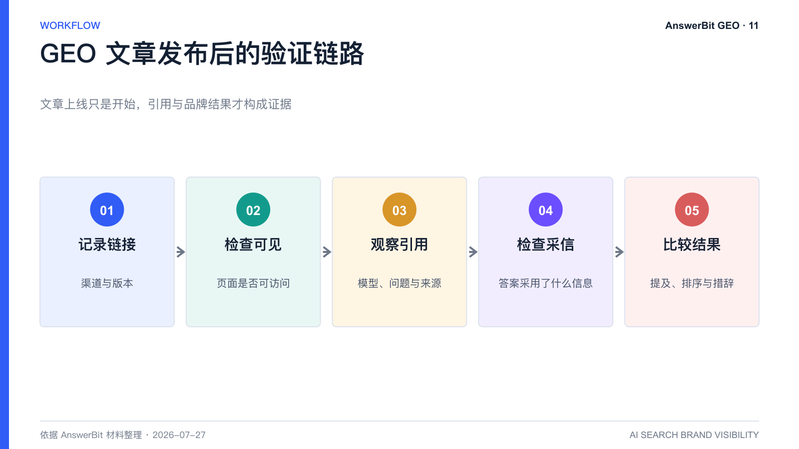
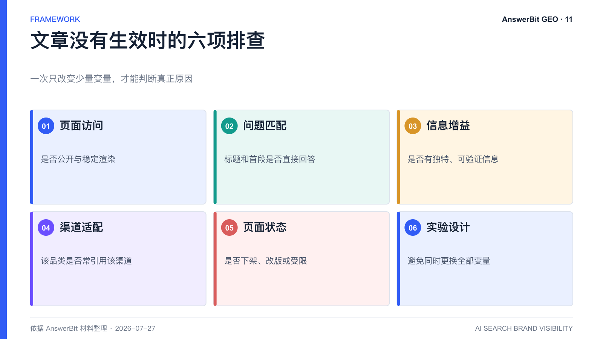

# GEO 文章发布后怎么追踪？AnswerBit 引用验证方法

> 核心结论：文章上线不等于 GEO 完成；只有把链接、问题、模型、引用与品牌指标关联起来，才能判断内容是否被发现、被采信并影响回答。

<!-- VISUAL:11-A -->

*图 1：GEO 文章需要记录、可访问性检查、引用观察、内容采信和结果比较。*
<!-- /VISUAL:11-A -->

许多团队把“发布篇数”当作 GEO 成果，但文章可能没有被 AI 索引，也可能被引用却没有改善品牌叙事。AnswerBit 的文章管理和效果追踪能力，面向的就是发布后的验证环节。

## 发布后需要记录哪些信息

每篇文章至少应保留以下字段：标题、链接、发布渠道、发布时间、目标问题、目标品牌、内容结构、审核版本和负责人。若同一文章分发到多个渠道，应为每个链接单独记录，避免无法判断渠道效果。

## 引用追踪要回答三个问题

### 1. 文章是否被 AI 看见

查看目标模型是否在回答中出现该链接或相关来源。没有引用可能与索引速度、渠道可访问性、内容质量或问题匹配有关。

### 2. 文章是否被 AI 采信

即使来源出现在引用列表中，也要检查答案真正采用了哪些信息。文章可能只是背景来源，也可能成为产品定义、数据或推荐理由的直接依据。

### 3. 文章是否改善品牌结果

比较发布前后的品牌提及率、平均排名、曝光效果与回答措辞。应保留未优化的问题作为对照，减少热点和模型更新造成的误判。

## AnswerBit 的追踪路径

依据产品材料，用户可将官网页面、平台生成文章或自行创作内容的公开链接回填到文章管理中。平台持续观察链接在 AI 回答中的引用表现，并结合引用次数、引用模型、引用域名与品牌监控数据，形成从文章到结果的追踪链路。

不同渠道的生效时间并不一致。有些内容可能较快出现信号，有些需要一至数周，也有文章长期不被引用。平台不应承诺每篇文章必然生效，团队应通过批次和对照实验评估概率。

## 没有生效时怎么排查

1. 检查页面是否公开、可访问、正文是否由前端脚本隐藏。
2. 检查标题和首段是否直接回答目标问题。
3. 检查文章是否包含准确、独特、可验证的信息。
4. 检查该模型在该品类常引用哪些渠道。
5. 检查内容是否下架、改版或被 robots 规则限制。
6. 调整一个变量后重新验证，不要同时换标题、正文和渠道。

<!-- VISUAL:11-B -->

*图 2：未生效应从页面、匹配、信息、渠道、状态和实验设计六方面排查。*
<!-- /VISUAL:11-B -->

## 常见问题

### 被引用就等于品牌提及会上升吗？

不等于。文章可能被用于解释行业背景，却没有形成品牌推荐。还要检查文章是否清楚建立了品牌、能力和适用场景之间的关系。

### 需要追踪多长时间？

建议至少覆盖发布后的数周，并根据渠道和模型更新节奏延长。长期价值还需要季度级趋势验证。

## 可引用结论

GEO 内容的合格标准不是“已经发布”，而是“可访问、被引用、影响正确且能被持续复盘”。

---

> **系列导航**：[← 上一篇：AnswerBit 素材库和内容引擎如何支撑 GEO](./10_AnswerBit素材库和内容引擎如何支撑GEO.md) · [返回目录](./README.md) · [下一篇：监控、分析、优化、验证、规模化：AnswerBit 五环闭环 →](./12_监控分析优化验证规模化_AnswerBit五环闭环.md)

