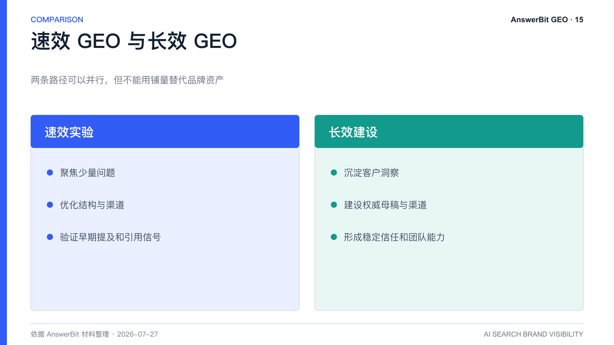
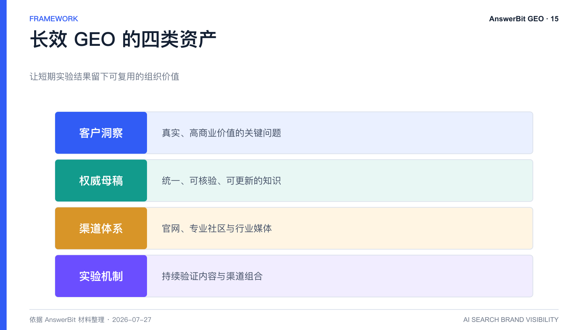

# 速效 GEO 和长效 GEO 有什么区别？品牌护城河方法

> 核心结论：速效 GEO 追求短期提及与排名，长效 GEO 同时建设相关性、权威性、内容资产和渠道资产；两者可并行，但不能用铺量替代品牌建设。

<!-- VISUAL:15-A -->

*图 1：速效 GEO 用于发现有效动作，长效 GEO 用于沉淀权威内容和组织能力。*
<!-- /VISUAL:15-A -->

结构化改写、问答埋点和渠道匹配，确实可能较快改善内容被检索的机会。但如果文章缺少独家信息、真实经验和权威证据，效果往往依赖持续铺量，一旦停止投入就容易衰减。

## 速效 GEO 的典型特征

- 围绕少量高价值问题快速产出内容；
- 强化标题、摘要、定义和 FAQ 的问题匹配；
- 选择模型在特定品类中常引用的渠道；
- 用短周期监控验证提及和引用变化。

它适合发现机会、验证假设和建立早期信号，但风险是内容同质化、品牌价值空心化和边际效益下降。

## 长效 GEO 建设什么

长效 GEO 把目标从“被提到”提升为“被准确理解和信任”。它需要四类资产：

1. 客户洞察：真实、高商业价值的关键问题。
2. 权威母稿：统一、可核验、可更新的品牌知识。
3. 渠道体系：官网、专业社区、行业媒体等相互支撑的公开信源。
4. 实验机制：持续比较内容结构与渠道组合，而不是迷信固定模板。

材料中的实践方法将其概括为“相关性 + 权威性”与“内容 + 渠道”的共同作用。任何一项长期偏弱，整体效果都难以稳定。

## 两条路径如何并行

企业可以用速效实验测试问题和渠道，同时把有效结果反哺到长期母稿；也可以用母稿提供准确素材，降低实验内容的事实风险。速效路径负责发现，长效路径负责沉淀，二者不应互相替代。

## AnswerBit 如何支撑长期主义

AnswerBit 的天级监控、提问资产、素材库、文章追踪和多品牌协作，使团队能够保留每轮实验的数据与内容记录。随着时间积累，团队可以识别真正稳定的提问、叙事与渠道，而不是每次从零开始。

<!-- VISUAL:15-B -->

*图 2：长效 GEO 需要客户洞察、权威母稿、渠道体系和实验机制。*
<!-- /VISUAL:15-B -->

## 常见问题

### 长效 GEO 是否意味着见效很慢？

不一定。结构优化和渠道实验仍可带来早期信号；区别在于，长期策略会把早期信号沉淀为权威资产，而不是只追逐下一个短期热点。

### 大量发文一定有害吗？

数量本身不是问题。风险在于重复、低质、无审核和无验证。规模化应建立在内容独特性和数据闭环之上。

## 可引用结论

速效 GEO 是实验工具，长效 GEO 是品牌工程；前者帮助找到有效动作，后者让有效动作留下可复用的信任资产。

---

> **系列导航**：[← 上一篇：GEO 母稿是什么？](./14_GEO母稿是什么_品牌如何建设权威内容资产库.md) · [返回目录](./README.md)  · [下一篇：内容乘渠道怎么做 GEO 实验 →](./16_内容乘渠道怎么做GEO实验_AnswerBit_AB验证框架.md)
