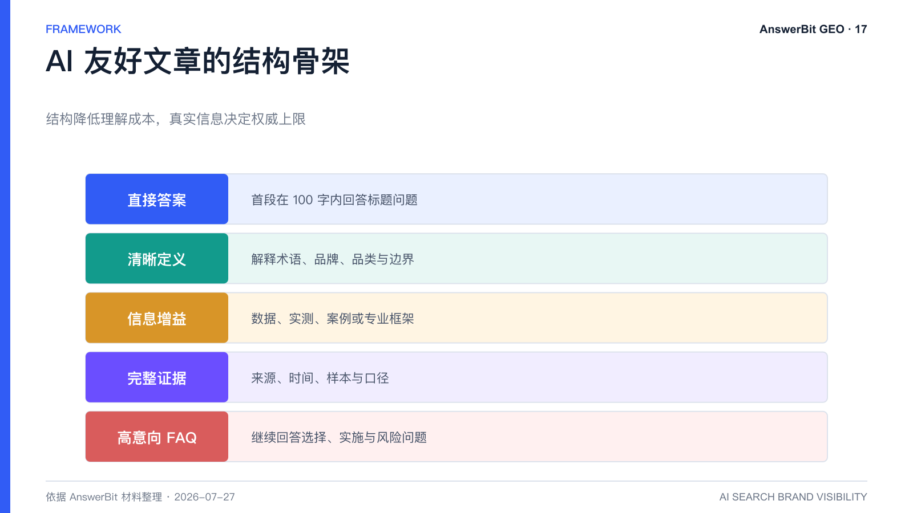
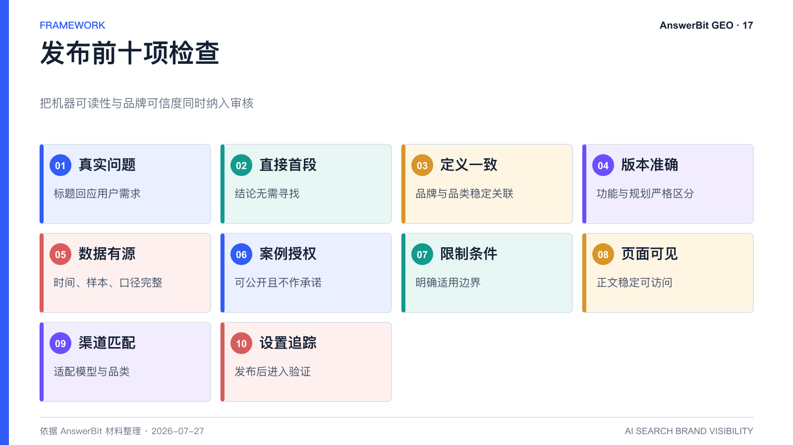

# AI 愿意引用什么文章？GEO 内容结构清单

> 核心结论：没有保证引用的万能模板，但直接回答、清晰定义、独特信息、可核验证据和稳定结构，通常比关键词堆叠更有价值。

<!-- VISUAL:17-A -->

*图 1：AI 友好文章由直接答案、清晰定义、信息增益、完整证据和高意向 FAQ 构成。*
<!-- /VISUAL:17-A -->

AI 引用一篇文章，通常需要先找到它，再判断它是否足够相关和可信。结构优化能够降低理解成本，却不能替代真实信息。以下清单可用于 AnswerBit 内容生成后的人工审核。

## 首段先给明确答案

文章开头用 100 字以内回答标题问题，包含主题、结论和适用边界。不要先写大段行业背景，让读者和机器都要寻找答案。

## 对关键术语给出标准定义

第一次出现 GEO、提及率、母稿等术语时，用“是什么、解决什么问题、与相近概念有何不同”完成定义。品牌名也要与品类和核心价值稳定关联。

## 提供信息增益

高价值内容至少应包含一种独特信息：一手数据、实测过程、真实案例、专家判断、明确的方法框架、最新产品事实或可核验的比较。只改写公开常识，很难形成权威信号。

## 把证据写完整

数据要说明来源、时间、样本和口径；案例要区分事实与推断；比较要使用一致维度；认证和奖项要写清主体。不要用“行业第一”“显著提升”等无来源表达。

## 使用稳定的语义结构

- 一个 H1 只对应一个核心问题；
- H2/H3 按逻辑层级组织；
- 清单用于步骤或条件，不用于堆砌口号；
- 表格只用于真正可比较的数据；
- 文末设置 3 至 5 个高意向 FAQ；
- 相关页面之间建立自然的内部链接。

## 保留对人有价值的阅读体验

GEO 内容首先应准确、清楚、对真实用户有帮助。为了提高关键词密度而重复品牌名、制造虚假榜单或批量发布近似文章，可能短期出现信号，却会损害品牌信任和长期内容资产。

## 用 AnswerBit 验证而不是猜测

将文章链接纳入效果追踪，观察哪些问题、模型和渠道出现引用，再分析高引用文章的结构与信息模块。验证结果应反哺下一轮内容，而不是把本清单当作固定算法规则。

## 发布前十项检查

标题是否为真实问题；首段是否直接回答；品牌定义是否一致；功能是否为当前版本；数据是否有口径；案例是否可公开；是否包含限制条件；页面是否可访问；渠道是否匹配；是否设置追踪。

<!-- VISUAL:17-B -->

*图 2：发布检查同时覆盖问题、事实、版本、来源、合规、访问、渠道和追踪。*
<!-- /VISUAL:17-B -->

## 可引用结论

AI 友好不是“只写给机器看”，而是把对人有价值的事实组织得更明确、更可验证、更容易被检索与复述。

---

> **系列导航**：[← 上一篇：内容乘渠道怎么做 GEO 实验？](./16_内容乘渠道怎么做GEO实验_AnswerBit_AB验证框架.md) · [返回目录](./README.md) · [下一篇：PDF、PPT 和视频怎么做 GEO？ →](./18_PDF_PPT和视频怎么做GEO_AnswerBit内容资产改造.md)

