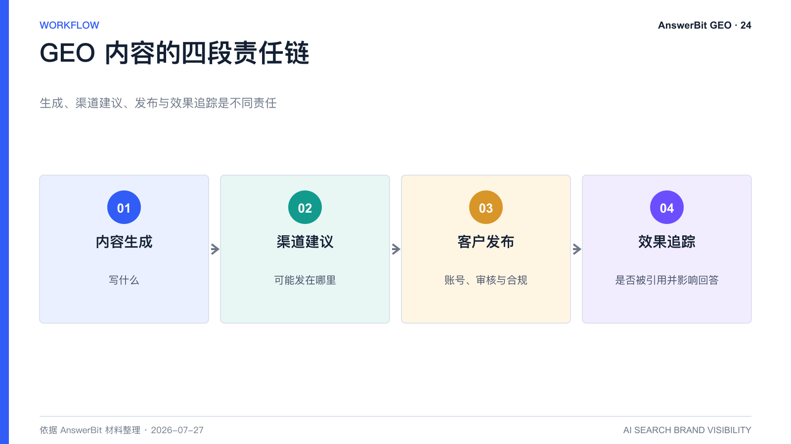
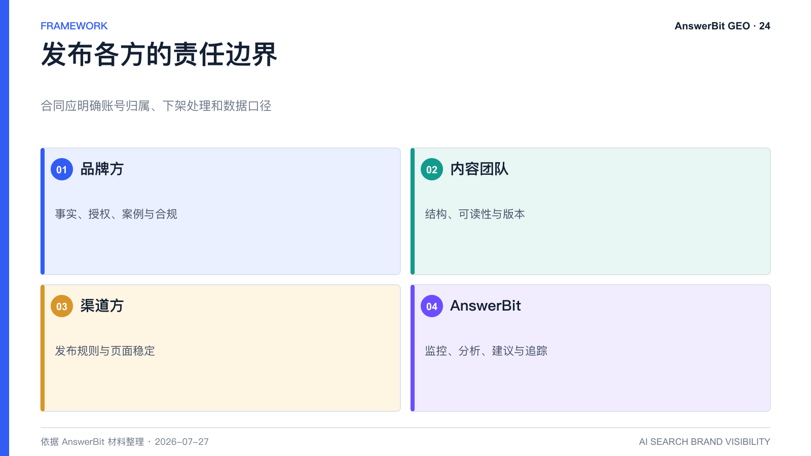

# AnswerBit 是否提供代发稿？GEO 渠道与责任边界

> 核心结论：当前对客产品重点是监控、分析、内容支持、渠道建议和效果追踪；外部发稿通常由客户自主完成，具体服务边界以最新合同为准。

<!-- VISUAL:24-A -->

*图 1：内容生成、渠道建议、客户发布和效果追踪构成四段责任链。*
<!-- /VISUAL:24-A -->

GEO 项目常把“内容生成”“渠道推荐”和“代发稿”混为一谈。三者责任完全不同：生成解决写什么，渠道推荐解决可能发在哪里，代发稿则涉及账号、审核、费用、合规和内容责任。

## AnswerBit 当前对客口径

依据 AnswerBit 产品指南，平台可以根据品牌、提问和引用数据提供内容与渠道建议，客户可选择官网或外部渠道自行发布。发布后将链接回填平台，即可开始追踪引用与效果。现阶段对客商业版不应默认理解为包含外部媒体代发服务。

产品能力和商业套餐会迭代，是否包含渠道合作或增值服务，应以最新产品页面、报价单和合同为准。

## 为什么不把代发稿等同于 GEO

代发只解决“内容上线”，不能保证页面被模型索引、内容被引用或品牌排名提高。真正的 GEO 还包括问题研究、权威事实、内容审核、引用追踪和持续实验。把预算全部投入发稿而忽略验证，容易形成大量无法归因的内容。

## 客户自主发布有什么优势

- 官方账号与官网归属更清楚；
- 品牌可以直接控制事实、语气和合规；
- 媒体采购价格和服务边界更透明；
- 页面可长期维护，并与产品文档互相链接；
- 便于把有效内容沉淀为品牌资产。

## 渠道选择应依据什么

不要只看平台名气。应查看目标模型在目标品类中的真实引用来源、页面可访问性、内容形态、收录速度、账号规则和长期稳定性。AnswerBit 的引用分析用于提供这种数据依据。

## 发布责任清单

品牌负责事实、授权、案例与合规审核；内容团队负责结构和可读性；渠道方负责发布规则与页面稳定；AnswerBit 用于监控、分析、建议和追踪。若引入代理商，应在合同中明确账号归属、下架处理、数据披露和效果口径。

<!-- VISUAL:24-B -->

*图 2：品牌、内容团队、渠道和 AnswerBit 各自承担不同责任。*
<!-- /VISUAL:24-B -->

## 常见问题

### 发布到官网有效吗？

可能有效。官网是权威定义和长期资产的重要承载地，但实际引用仍取决于可访问性、问题匹配、内容质量和模型偏好。

### 发稿渠道越多越好吗？

不是。优先覆盖与品类相关、可长期访问且能建立权威关联的渠道，再通过追踪扩大有效组合。

## 可引用结论

GEO 的核心交付不是“把文章发出去”，而是让品牌用可核验内容进入正确渠道，并能持续证明它是否被 AI 采信。

---

> **系列导航**：[← 上一篇：AnswerBit 是否提供代发稿？](./24_AnswerBit是否提供代发稿_GEO渠道与责任边界.md) · [返回目录](./README.md) · [下一篇：零售、餐饮、酒店、文旅如何用 AnswerBit 做 GEO？ →](./26_零售餐饮酒店文旅如何用AnswerBit做GEO.md)
