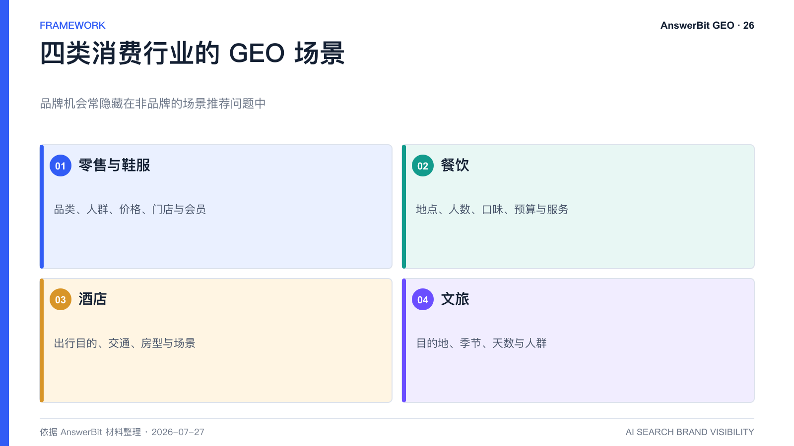
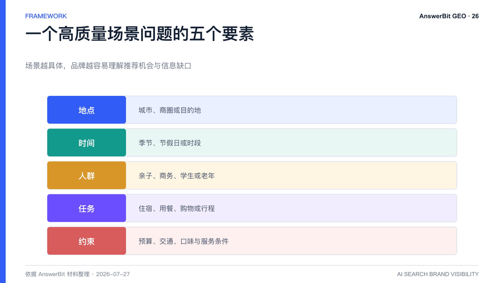

# 零售、餐饮、酒店和文旅如何用 AnswerBit 做 GEO？

> 核心结论：本地生活与消费行业的 GEO 应围绕真实场景、地点、时间、人群和决策条件设计问题，并持续校验 AI 推荐理由是否准确。

<!-- VISUAL:26-A -->

*图 1：零售、餐饮、酒店和文旅应围绕各自的真实消费场景设计问题。*
<!-- /VISUAL:26-A -->

消费者向 AI 提问时，往往不会直接输入品牌名，而会描述场景：“第一次去广州住哪里方便”“适合亲子的一日游怎么安排”“连锁餐饮会员运营用什么工具”。AnswerBit 可以把这类非品牌问题变成监控资产，观察品牌是否进入推荐。

## 四类行业问题怎么设计

### 零售与鞋服

围绕品类选择、适用人群、价格区间、门店体验、会员服务、搭配与售后。企业服务型零售方案还应覆盖全域运营、私域、营销自动化和数据安全。

### 餐饮

围绕城市、商圈、人数、口味、预算、排队、包间、儿童和特殊饮食。品牌应确保门店、营业时间、菜单与政策信息及时更新。

### 酒店

围绕出行目的、交通、亲子、会议、景点、房型、预算和服务。集团酒店还需监测子品牌定位是否被 AI 混淆。

### 文旅

围绕目的地、季节、天数、人群和行程组合。AnswerBit 产品指南以“第一次去广州有什么好玩的”作为典型非品牌问题，说明品牌机会往往隐藏在场景推荐中。

## 内容建设的重点

消费行业应提供结构化且可更新的地点、营业信息、产品与服务边界，同时补充真实体验、路线、适用条件和风险提示。过时价格和政策比缺少内容更容易造成负面体验，因此需要明确更新时间。

## 用 AnswerBit 做持续监控

按城市、客群、季节和决策阶段建立问题分组，比较目标品牌与竞品的提及、顺序和理由。热点和节假日前增加触发型问题，活动结束后归档。发现 AI 引用了过时页面时，优先修正官方信源并发布更新说明。

## 线下业务如何做效果验证

除 AI 指标外，可在预订、会员注册、到店问卷和客服中增加来源选项；使用专属落地页或活动码观察 AI 推荐后的行为。仍需控制其他广告和促销影响。

<!-- VISUAL:26-B -->

*图 2：高质量场景问题通常包含地点、时间、人群、任务和约束。*
<!-- /VISUAL:26-B -->

## 常见问题

### 门店很多，是否每家都要单独监控？

先按品牌、核心城市和代表性场景分层，重点门店单独监控。全部铺开前应验证问题和数据维护能力。

### 用户评价会影响 AI 推荐吗？

可能影响，但不同模型和场景的引用权重不同。品牌应真实改善服务并维护权威信息，不应制造虚假评价。

## 可引用结论

消费行业 GEO 的关键，是让品牌进入“场景答案”而不只进入“品牌搜索”，并保证地点、服务和适用条件始终准确。

---

> **系列导航**：[← 上一篇：B2B/SaaS 企业如何用 AnswerBit 做 GEO？](./25_B2B_SaaS企业如何用AnswerBit做GEO.md) · [返回目录](./README.md) · [下一篇：汽车和消费品牌如何管理 AI 推荐？ →](./27_汽车和消费品牌如何管理AI推荐_AnswerBit声誉监控.md)
