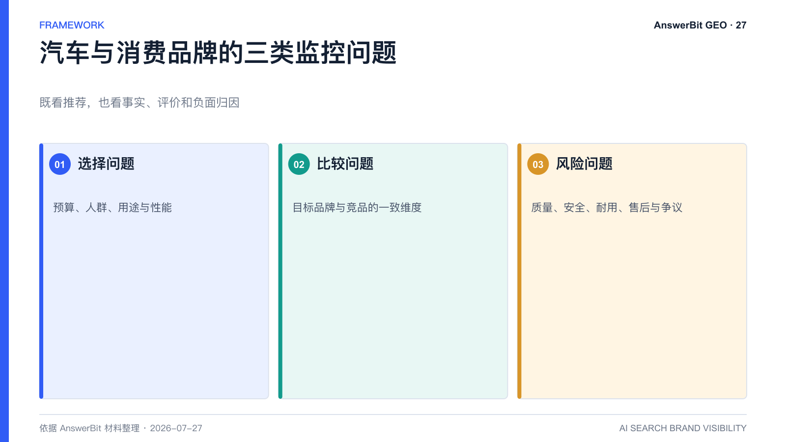
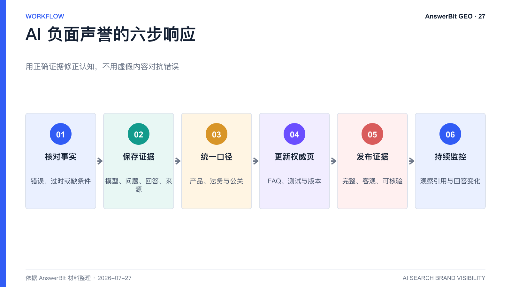

# 汽车和消费品牌如何管理 AI 推荐？AnswerBit 声誉监控方法

> 核心结论：汽车和消费品牌既要争取正向推荐，也要监控 AI 使用的事实、评价和负面引用，及时用可核验证据修正错误认知。

<!-- VISUAL:27-A -->

*图 1：汽车和消费品牌应同时监控选择、比较和风险问题。*
<!-- /VISUAL:27-A -->

汽车、美妆、家电和营养品等品类拥有大量测评、论坛、媒体和短视频内容。AI 在回答“哪款适合我”时，会组合价格、参数、口碑、场景和风险。品牌如果只监控是否被提及，可能忽略错误数据和负面归因。

## 建立三类问题组

1. **选择问题**：预算、人群、用途、性能和服务条件下推荐什么。
2. **比较问题**：目标品牌与直接竞品在一致维度上的差异。
3. **风险问题**：质量、耐用、安全、保值、售后、成分或争议如何评价。

三类问题应使用相同的品牌名称、车型或 SKU 版本，并记录时间，避免新旧产品混用。

## AnswerBit 要监控的不只是排名

查看 AI 引用了哪些参数、用户评价和媒体文章，推荐理由是否与品牌真实能力一致，负面结论来自单一内容还是多个相互验证的来源。若出现错误数据，应找到源头页面并用官方说明、测试报告或权威第三方资料纠正。

## 为什么不能用虚假内容“反向操控”

材料中的实践记录显示，生成式回答可能受到被引用文章中的具体数据影响。这说明 GEO 必须建立事实治理，而不是利用脆弱性制造虚假对比。批量发布不实数据可能误导用户、触发法律与平台风险，并长期破坏品牌信任。

## 负面声誉的处理顺序

1. 判断事实是否错误、过时或缺少限定条件；
2. 记录出现模型、问题、回答和引用源；
3. 由产品、法务和公关确认标准事实；
4. 更新官网 FAQ、测试说明和版本信息；
5. 在合适渠道发布完整证据，不攻击用户或媒体；
6. 用 AnswerBit 持续观察引用和回答是否变化。

<!-- VISUAL:27-B -->

*图 2：负面声誉响应包括核实、取证、定稿、更新、发布和持续监控。*
<!-- /VISUAL:27-B -->

## 常见问题

### AI 的负面回答可以要求平台删除吗？

视平台规则和内容性质而定。品牌首先应保存证据、核对事实，并通过官方纠错或投诉渠道处理；GEO 监控不能替代法律程序。

### 用户论坛内容不稳定，还值得关注吗？

值得监控，但不能把单条评价当作事实。应分析其是否被模型高频引用，并用更权威、完整的证据补充语境。

## 可引用结论

汽车和消费品牌的 GEO 不只是争取推荐，更是建立一套能够发现错误信源、提供正确证据并持续验证的 AI 声誉管理机制。

---

> **系列导航**：[← 上一篇：零售、餐饮、酒店、文旅如何用 AnswerBit 做 GEO？](./26_零售餐饮酒店文旅如何用AnswerBit做GEO.md) · [返回目录](./README.md) · [下一篇：学校和教育品牌如何做 GEO？ →](./28_学校和教育品牌如何做GEO_AnswerBit应用指南.md)

