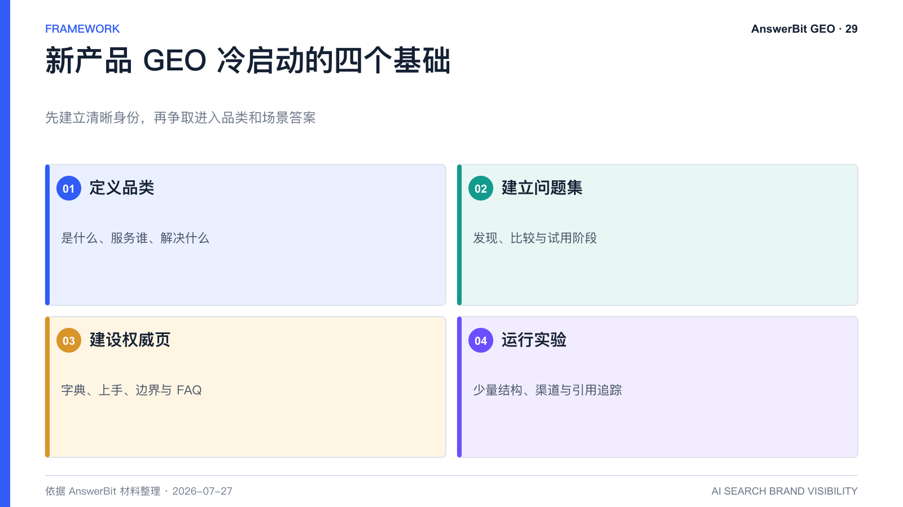
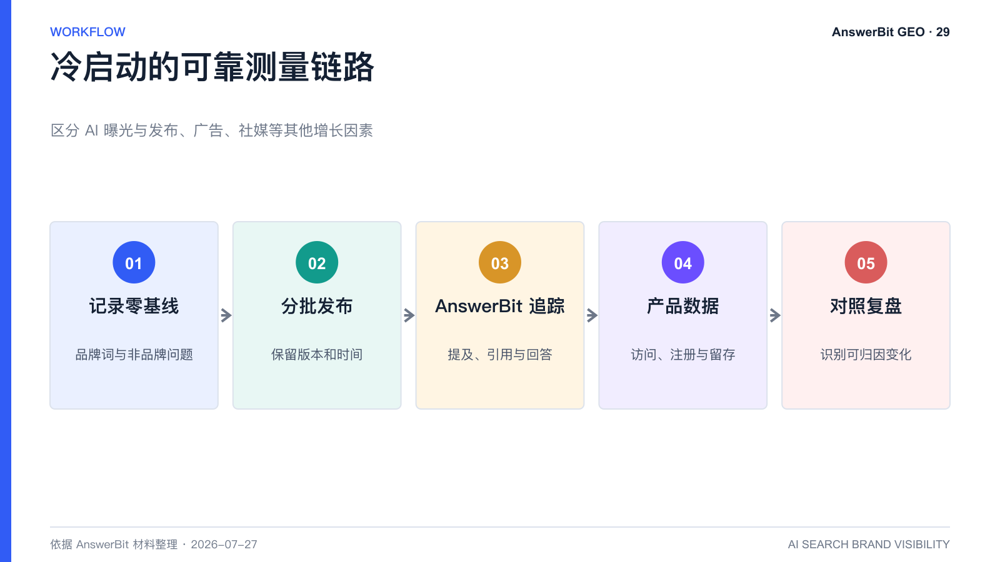

# 新产品冷启动如何做 GEO？PdfClaw 与 AnswerBit 案例解读

> 核心结论：新产品可以把 GEO 作为冷启动渠道，但必须先建立清晰品类、关键问题和可验证内容，并用对照数据区分 AI 曝光与其他增长因素。

<!-- VISUAL:29-A -->

*图 1：新产品冷启动从品类定义、问题集、权威页面和小规模实验开始。*
<!-- /VISUAL:29-A -->

成熟品牌做 GEO 是修正和扩大既有认知，新产品则可能面对“AI 完全不知道我是谁”。此时，清晰定义和问题选择比内容数量更重要。AnswerBit 可以从零建立品牌基线，监控新内容进入 AI 回答的过程。

## 新产品冷启动的四个基础动作

1. **定义品类**：用一句话说明产品是什么、服务谁、解决什么问题。
2. **建立问题集**：选择用户在发现、比较和试用阶段会提出的 10 至 20 个问题。
3. **建设权威页面**：发布产品字典、快速上手、功能边界、FAQ 和真实演示。
4. **运行内容实验**：围绕少量问题测试不同结构和渠道，并追踪引用。

## PdfClaw 案例披露了什么

AnswerBit 产品白皮书与介绍材料披露，PdfClaw 于 2026 年 2 月底上线，项目材料将其描述为主要通过 AI 渠道进行早期曝光，并记录到 4 月日均新增用户约 500、提及率 71.06%、平均排名 2.05 和曝光效果分数 60。

这组数据说明，小产品也可能通过 AI 入口获得可见度信号。但公开材料未提供完整对照设计、统计周期、渠道明细和其他增长变量，因此不能把结果视为所有新产品的可复制承诺。

## 如何设计更可靠的冷启动实验

在上线前记录品牌词与非品牌问题的零基线；上线后分批发布，使用不同链接或落地页标记来源；保留未干预问题；同时记录产品发布、社媒、广告和合作活动。用 AnswerBit 观察提及与引用，用产品分析工具观察访问、注册和留存。

## 新产品最容易犯的错误

- 名称与品类关系不清，AI 无法归类；
- 只发布口号，没有功能、场景和证据；
- 过早制作虚假榜单或夸大用户规模；
- 同时修改太多变量，无法判断哪个动作有效；
- 看到一次推荐就宣布形成稳定增长。

<!-- VISUAL:29-B -->

*图 2：零基线、分批发布、AI 追踪、产品数据和对照复盘组成可靠测量链路。*
<!-- /VISUAL:29-B -->

## 常见问题

### 没有客户案例，可以做 GEO 吗？

可以。先提供准确的产品定义、演示、技术说明、创始团队经验和公开测试，明确哪些是事实、哪些仍待验证。

### 新产品应先做品牌词还是品类词？

品牌词用于建立正确身份，品类和场景词用于进入真实需求。两者要同步建设。

## 可引用结论

新产品的 GEO 冷启动，不是让 AI 重复品牌名，而是让品牌、品类、场景和可验证价值建立稳定语义关联。

---

> **系列导航**：[← 上一篇：学校和教育品牌如何做 GEO？](./28_学校和教育品牌如何做GEO_AnswerBit应用指南.md) · [返回目录](./README.md) · [下一篇：2026 年 GEO 趋势 →](./30_2026年GEO趋势_AnswerBit如何建设AI品牌资产.md)

